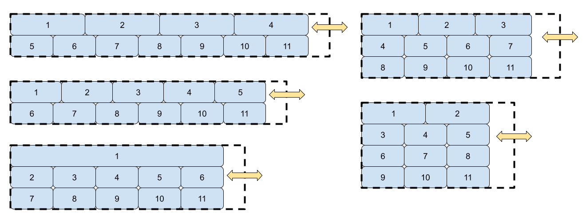

# Ben Storlie's Portfolio

This page is very much a work in progress.  I have some specific ideas for what I want it to look like, and there are some parts I haven't decided about and have just put random colors.  And, of course, I need to actually detail all of my projects.

## Installation

The page is available at https://benjstorlie.github.io/portfolio/

## Development Comments

1. The assignment's Acceptance Criteria included

>WHEN I am presented with the developer's first application
>THEN that application's image should be larger in size than the others

The first way I wanted to implement this was to make each section's flexbox wrap in this way:

So the row with the fewest items is the row containing the first items listed.  So while it's not exactly that the first application is larger that all of the others, it's the first one or two that are larger.  I think it looks nice.

However, sometimes it wraps so that each row has an equal number of items.  Because of that, I wanted the first row to be taller that the other rows.  I was not able to do this, and was only able to heighten the first item, but the rest of the items on that row did not follow suit.

2. Another Acceptance Criterion was

>WHEN I click on the images of the applications
>THEN I am taken to that deployed application

I haven't made any applications that can be deployed?  I linked the images to my old Blogger portfolio that was last updated five years ago.  I also included some generic placeholder images that link to a generic placeholder page.

3. The design very much will be changed in the future from its current state.  Much of the sizing and spacing really needs work, and I think that will be easier to do when I have more actual content to work with.